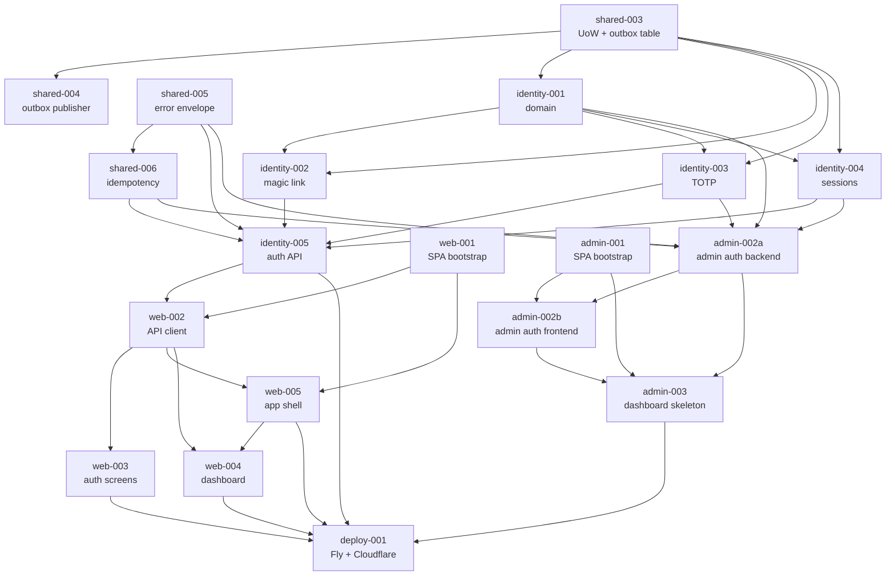

# Phase 1 Brief Set — Summary

**Generated:** 2026-04-26
**Source of truth:** `docs/architecture-decisions.md` (authoritative — wins on conflict)

---

## Counts

- **Total briefs:** 18 (the handoff's enumerated list shows 20 lines, two are pre-completed in bootstrap: `phase1-shared-001`, `phase1-shared-002`)
- **By complexity:** S × 4 · M × 11 · L × 3 · XL × 0 (forbidden)
- **By SDD mode:** strict × 11 · lightweight × 7
- **By context:** shared × 4 · identity × 5 · web × 5 · admin × 3 · deploy × 1

---

## Dependency-ordered list

| # | Brief ID | Title | C | Mode | Depends on |
|---|---|---|---|---|---|
| 1 | `phase1-shared-003` | Concrete UoW + DomainEvent outbox table | L | strict | — (uses bootstrap) |
| 2 | `phase1-shared-004` | Outbox publisher worker (arq) + EventBus | M | strict | shared-003 |
| 3 | `phase1-shared-005` | Error envelope mapper + DomainError → HTTP | S | strict | — (uses bootstrap) |
| 4 | `phase1-shared-006` | Idempotency middleware (Redis dual-layer) | M | strict | shared-005 |
| 5 | `phase1-identity-001` | Identity domain (User, Session, MagicLink, TotpSecret) | M | strict | shared-003 |
| 6 | `phase1-identity-002` | Magic-link signup/login + console email adapter | L | strict | identity-001, shared-003 |
| 7 | `phase1-identity-003` | TOTP enrollment + verification + lockout | M | strict | identity-001, shared-003 |
| 8 | `phase1-identity-004` | Session mgmt: cookies, CSRF, refresh rotation | M | strict | identity-001, shared-003 |
| 9 | `phase1-identity-005` | Auth API endpoints + OpenAPI | M | strict | identity-002/003/004, shared-005, shared-006 |
| 10 | `phase1-web-001` | Web SPA bootstrap (Vite, Tailwind, tokens) | M | lightweight | — |
| 11 | `phase1-web-002` | API client, TanStack Query, error boundary | S | lightweight | web-001, identity-005 |
| 12 | `phase1-web-003` | Auth screens (signup, magic-link, login, TOTP enroll) | L | lightweight | web-002, identity-005 |
| 13 | `phase1-web-005` | App shell, routing, session bootstrap | M | lightweight | web-001, web-002 |
| 14 | `phase1-web-004` | Dashboard skeleton + Tier-0 banner + empty states | M | lightweight | web-005, web-002 |
| 15 | `phase1-admin-001` | Admin SPA bootstrap (separate Vite app) | S | lightweight | — |
| 16a | `phase1-admin-002a` | Admin auth backend (password+TOTP, session, seed CLI) | M | strict | identity-001/003/004, shared-005/006 |
| 16b | `phase1-admin-002b` | Admin auth frontend (login + TOTP routes) | S | lightweight | admin-001, admin-002a |
| 17 | `phase1-admin-003` | Admin dashboard skeleton (empty queues) | S | lightweight | admin-001, admin-002a, admin-002b |
| 18 | `phase1-deploy-001` | Deploy backend Fly.io + frontends Cloudflare Pages | M | lightweight | identity-005, web-003/004/005, admin-003 |

> Note on web-004 / web-005 ordering: the original prior-session plan listed web-004 before web-005, but web-005 (the app shell) is the foundation web-004 (the dashboard inside the shell) renders inside. Corrected: web-005 ships first, web-004 ships after.

---

## Dependency graph (mermaid)

---

## Contradictions surfaced (`architecture-decisions.md` wins, briefs follow architecture)

1. **JWT vs opaque session cookies.** `claude-code-spec.md` (line 654) proposes JWT for auth; `architecture-decisions.md` Section 4 explicitly rejects JWT and mandates opaque session tokens (`vc_at_<rand>` looked up in Redis). All identity briefs (002–005) and admin-002a follow the architecture-decisions pattern.
2. **Admin URL prefix.** `claude-code-spec.md` uses `/api/admin/...`; `architecture-decisions.md` Section 4 uses `/admin/api/v1/...`. Briefs follow architecture.

Neither contradiction blocks generation. Both are flagged here so reviewers know which doc wins when they cross-read.

---

## Phase 1 exit criteria (what this brief set delivers when all 18 are merged)

- Working magic-link + TOTP signup and login flow against a deployed backend.
- A user lands on a credible-looking dashboard with three empty wallet placeholders + Tier 0 KYC nudge.
- An admin can log in via separate SPA at `admin.vaultchain.io` and see a placeholder dashboard.
- Live URLs: `app.vaultchain.io`, `admin.vaultchain.io`, `api.vaultchain.io/docs`.
- Outbox + idempotency + error-envelope infrastructure ready to receive Phase 2 contexts.
- Sentry receiving errors; Telegram receiving deploy notifications; CI gate on lint + test + import-linter + mypy strict.

---

## Notes on what Phase 2 inherits

- The shared infra (UoW, outbox, idempotency, error envelope) is the foundation Phase 2 builds on. Custody, Chains, Audit will plug in via the EventBus already wired.
- Stub modules (`walletsStub.ts`, `transactionsStub.ts`) are flagged for replacement.
- ConsoleEmailSender remains in console mode — Phase 2 introduces a real email adapter (likely Postmark or SES) when KYC notification emails come into scope.
- The audit-event publishes from admin-002a (`audit.AdminAuthenticated`) sit in the bus with no consumer; the Audit context in Phase 2 attaches a subscriber and replays from a checkpoint.
