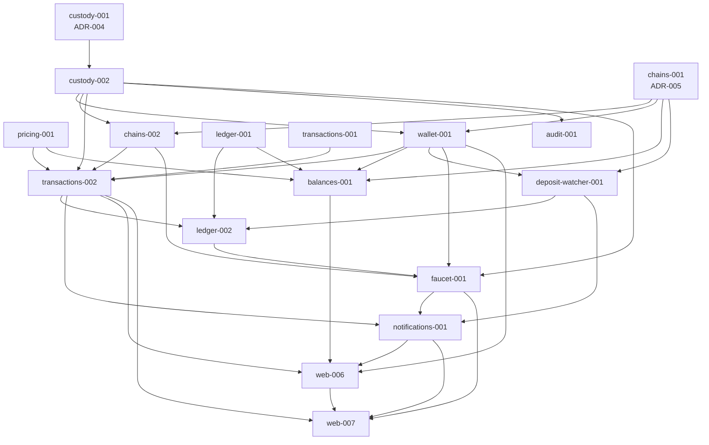

# Phase 2 — Brief generation summary

**Status:** complete · 17 briefs delivered · awaiting user ack to proceed to Phase 3 plan

**Phase 2 deliverable per `00-product-identity.md`:** "working custodial wallet on ETH. Can send test transactions via the app." A new user can sign up, get tokens via in-app faucet, see balance, send to another testnet address, see it confirm in the activity list, verify on Etherscan Sepolia. Audit log captures KMS operations. Real email via Resend.

---

## Brief inventory

| # | Brief ID | Title | Complexity | Mode |
|---|---|---|---|---|
| 1 | `phase2-pricing-001` | Pricing context (USD via CoinGecko + cache + fallback) | S | strict |
| 2 | `phase2-custody-001` | Custody domain — KMS port, envelope encryption, ADR-004 | L | strict |
| 3 | `phase2-custody-002` | KMS adapter (LocalStack/AWS) + signing service + ETH signer | M | strict |
| 4 | `phase2-chains-001` | Chains skeleton + Ethereum read adapter + ADR-005 | M | strict |
| 5 | `phase2-chains-002` | Ethereum write path (build/fee/broadcast/receipt monitor) | L | strict |
| 6 | `phase2-wallet-001` | Wallet domain + provision-on-signup + GET /wallets | M | strict |
| 7 | `phase2-ledger-001` | Ledger domain (postings/entries/accounts) + double-entry | L | strict |
| 8 | `phase2-balances-001` | Balances read-projection + GET /portfolio | M | strict |
| 9 | `phase2-transactions-001` | Transactions domain (state machine + Drafts) | L | strict |
| 10 | `phase2-transactions-002` | Send use cases (Prepare/Confirm/Execute) + API | M | strict |
| 11 | `phase2-ledger-002` | Ledger subscribers (deposit/withdrawal posting handlers) | M | strict |
| 12 | `phase2-deposit-watcher-001` | ETH block scanner → DepositDetected → Ledger posts | L | strict |
| 13 | `phase2-audit-001` | Audit context + log table + subscribers + /admin/audit | M | strict |
| 14 | `phase2-faucet-001` | Sepolia faucet (own wallet, rate-limited, mock USDC) | M | strict |
| 15 | `phase2-notifications-001` | Notifications + SSE channel + Resend email adapter | L | strict |
| 16 | `phase2-web-006` | Real wallet/balance/history UI + receive + tx detail | L | lightweight |
| 17 | `phase2-web-007` | Send flow UI (form → review → TOTP → broadcast) + funding | L | lightweight |

**Counts:** S × 1 · M × 9 · L × 7 · XL × 0 (forbidden) · Strict × 15 · Lightweight × 2

---

## Dependency graph

---

## Architecture-mandated property tests covered

Per `architecture-decisions.md` Section 5, six property tests are mandatory:

| # | Property | Brief covering it |
|---|---|---|
| 1 | Money arithmetic (associativity, quantization round-trip) | `ledger-001` |
| 2 | State machine (no orphan states, all valid transitions reachable) | `transactions-001` |
| 3 | Ledger posting balance invariant | `ledger-001` |
| 4 | User account never negative | `ledger-001` |
| 5 | Address VO parse-serialize round-trip | `chains-001` (Ethereum), Phase 3 (Tron, Solana) |
| 6 | KMS envelope encryption round-trip | `custody-001` (in-memory) + `custody-002` (real LocalStack) |
| 7 | Idempotency replay (same key returns same response) | `transactions-001` |

All seven covered for Phase 2's chain set.

---

## ADRs drafted in Phase 2

- **ADR-004 — Custody envelope encryption pattern.** Drafted in `custody-001`. Specifies: AES-256-GCM symmetric layer, KMS-managed master key per environment (dev: LocalStack, prod: AWS KMS in us-east-1), one master key total in V1 (`alias/vaultchain-custody-master`), data key per encryption (no caching), `key_version` column for future rotation.
- **ADR-005 — Chain testing asymmetry.** Drafted in `chains-001`. Anvil for Ethereum (real Solidity opcodes, identical RPC interface), deferred plans documented for Solana (`solana-test-validator`, Phase 3) and Tron (vcrpy recording — Tron's testnet has no usable local emulator).

---

## What ships at end of Phase 2

**Backend:**
- 8 new bounded contexts populated: pricing, custody, chains, wallet, ledger, balances, transactions, audit, faucet, notifications.
- AWS KMS / LocalStack envelope-encryption signing.
- Ethereum Sepolia: full read + write + receipt monitoring + deposit watching.
- Real double-entry ledger with caused_by_event_id idempotency.
- 7-status transaction state machine + drafts.
- Mock USDC contract on Sepolia for stablecoin testing.
- In-app Sepolia faucet (rate-limited 1/24h per asset).
- SSE channel `/api/v1/events` with Redis pub/sub multi-instance correctness.
- Resend email adapter replacing console output.

**Frontend:**
- Real wallet/balance/history dashboard (replaces Phase 1 stubs).
- Receive screen with QR code and address.
- Activity list paginated by date.
- Transaction detail with status timeline + Etherscan link.
- Send wizard: from-wallet → recipient/amount → review → TOTP → broadcasting → confirmed.
- Funding flow with quick-fund + external faucet deep links.
- SSE-driven real-time updates with polling fallback.

**Operations:**
- Updated `runbook.md` with: KMS key creation, mock USDC deployment, faucet wallet funding/refill, dead-letter event re-publish, audit log inspection, deposit backfill.
- Demo script at `docs/demo-script.md` covering the full Phase 2 happy path.

---

## What's still missing (Phase 3 + 4 scope)

**Phase 3 (~14-18 briefs anticipated):**
- Tron Shasta + Solana Devnet read/write adapters
- Tron + Solana wallet provisioning, signers, deposit watchers
- Cold tier withdrawal flow (real `ThresholdPolicy`, `awaiting_admin` route, withdrawal_reserved postings)
- Sumsub KYC: tier limits, applicant flow, webhook ingestion
- Full admin dashboard: KYC review queue, withdrawal approval queue, user management read views, audit viewer
- Contacts context (address book, label-by-address resolution)
- Reconciliation job real implementation

**Phase 4 (~10-14 briefs anticipated):**
- AI assistant: Claude integration, tool catalog, prep-card mid-stream protocol, RAG over docs, transaction memory via pgvector
- Polish: empty states across all surfaces, loading/error states, micro-interactions, mobile gestures
- Landing page final copy + demo video recording

---

## Open questions for user

1. **Threshold policy for Phase 2.** Current Phase 2 wires `AlwaysPassThresholdPolicy` (every tx → broadcasting, no admin route). Alternative: declare a per-chain config table now (empty / always-pass values) so Phase 3's threshold policy is a config change, not a code change. Recommendation: stick with the simpler `AlwaysPassThresholdPolicy` for Phase 2 and introduce the config table in Phase 3 — keeps Phase 2 brief count down. Open to override.

2. **Resend free tier.** Free tier = 100 emails/day, sufficient for portfolio scope. If a reviewer or stress-test exhausts it during demo, magic-link emails fail. Acceptable risk for V1; document fallback (operator can extract magic links from logs). Confirm.

3. **Mock USDC deployment.** Done as a one-time operator step via `forge create`, NOT automated in CI. Solidity source committed but bytecode/address goes to env. Reviewers may prefer an automated deploy. The trade-off: automated deploy needs CI to have a funded Sepolia wallet, which adds operational complexity. Recommendation: keep manual for V1. Confirm.

4. **The 12-confirmation depth.** Sepolia testnet, 12 blocks ≈ 2.5 minutes. Demo script will call this out. Lower depth (e.g., 3 blocks ≈ 36s) makes demos snappier but is less safe. Recommendation: keep 12 for portfolio honesty; document in demo script. Confirm.

---

## Next step after user ack

Propose Phase 3 brief plan (one-liners) for review. Phase 3 = "feature-complete product excluding AI": Tron + Solana + cold tier + Sumsub KYC + full admin dashboard. Estimated ~14-18 briefs.
