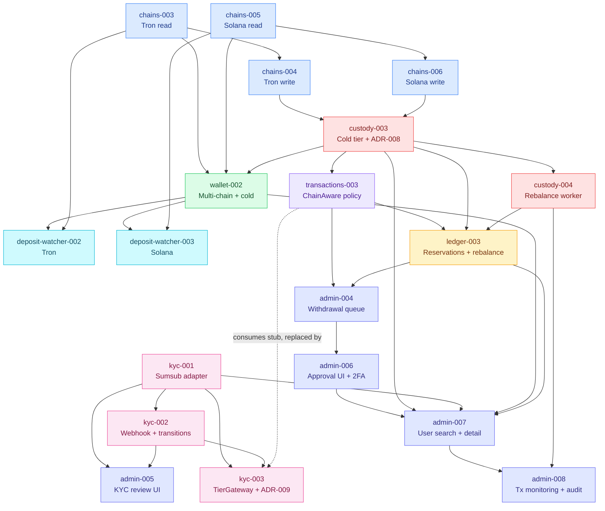

# Phase 3 Briefs — Summary

**VaultChain v1, Phase 3:** Multi-chain expansion (Tron + Solana), real custody hot/cold separation, KYC integration (Sumsub), and the admin operator surface.

---

## Exit criteria (verbatim, Phase 3 success definition)

A new user registers → completes Sumsub KYC tier 1 → receives hot+cold addresses on all 3 chains → deposits (e.g., 1 ETH) → rebalance worker automatically moves excess to cold (operator sees in admin) → small withdrawal (0.05 ETH) signs hot, broadcasts immediately → large withdrawal (0.5 ETH) routes to admin queue → admin approves with 2FA → cold-signed tx broadcasts → confirms → ledger releases reservation → user sees confirmed.

---

## Brief inventory (19 total)

| # | Brief ID | Title | C | SDD mode | Lines |
|---|----------|-------|---|----------|------:|
| 1 | `phase3-chains-003`     | Tron read adapter + Address VO + ADR-005 update                      | L | strict      | 134 |
| 2 | `phase3-chains-004`     | Tron write path (tronpy + vcrpy tests)                                | L | strict      | 135 |
| 3 | `phase3-chains-005`     | Solana read adapter + SPL token reads + ADR-005 update                | M | strict      | 138 |
| 4 | `phase3-chains-006`     | Solana write path (solana-py + test-validator)                        | L | strict      | 136 |
| 5 | `phase3-custody-003`    | Cold tier (dual KMS + cold signing + backfill + ADR-008)              | L | strict      | 147 |
| 6 | `phase3-custody-004`    | Hot↔cold rebalance worker                                             | M | strict      | 151 |
| 7 | `phase3-wallet-002`     | Multi-chain wallet provisioning + cold + asset catalog                | M | strict      | 136 |
| 8 | `phase3-deposit-watcher-002` | Tron deposit watcher                                             | M | strict      | 129 |
| 9 | `phase3-deposit-watcher-003` | Solana deposit watcher (commitment=finalized)                    | M | strict      | 130 |
| 10 | `phase3-transactions-003` | ChainAwareThresholdPolicy (real, KYC-tier-aware)                   | M | strict      | 187 |
| 11 | `phase3-ledger-003`     | Withdrawal reservation flow + `internal_rebalance` posting            | M | strict      | 165 |
| 12 | `phase3-admin-004`      | Withdrawal approval queue endpoints + state machine                   | M | strict      | 158 |
| 13 | `phase3-kyc-001`        | KYC context + Sumsub adapter + applicant create + status              | L | strict      | 189 |
| 14 | `phase3-kyc-002`        | Sumsub webhook (HMAC) + tier transitions + PII redaction              | M | strict      | 184 |
| 15 | `phase3-kyc-003`        | KYC tier enforcement port (`KycTierGateway`) + ADR-009                | S | strict      | 166 |
| 16 | `phase3-admin-005`      | Admin KYC review UI (queue + Sumsub iframe + escalate)                | L | lightweight | 132 |
| 17 | `phase3-admin-006`      | Admin withdrawal approval UI + 2FA + tx detail                        | M | lightweight | 129 |
| 18 | `phase3-admin-007`      | Admin user search + detail (cross-context, hot+cold)                  | L | lightweight | 131 |
| 19 | `phase3-admin-008`      | Admin transactions monitoring + audit timeline + manual rebalance     | L | lightweight | 156 |

**Counts.** Complexity: S × 1, M × 9, L × 9, XL × 0. SDD mode: strict × 15, lightweight × 4. Total ≈ 277 KB across 19 briefs.

---

## Dependency graph

The two long causal lines worth pointing out: (1) `chains-003 → C4 → CU3 → T3 → L3 → A4` is the on-chain → policy → ledger → operator vertical that proves the cold-signing pipeline. (2) `K1 → K2 → K3` runs parallel and feeds back into `T3` via gateway swap (the stub from transactions-003 gets replaced by the Sumsub-backed one defined in kyc-003).

---

## ADRs touched in Phase 3

| ADR | Action | Brief | Notes |
|-----|--------|-------|-------|
| ADR-005 | **Updated** — added Tron section | `phase3-chains-003` | base58check addresses, 20-block confirmation, vcrpy testing strategy |
| ADR-005 | **Updated** — added Solana section | `phase3-chains-005` | finalized commitment, ATA discipline, polling-primary watcher (WebSocket optional) |
| ADR-008 | **Drafted** — Hot/cold tier separation | `phase3-custody-003` | dual KMS master keys, separate IAM roles, cold-only-via-admin-path. Numbered ADR-008 because ADR-006 is already assigned in `architecture-decisions.md` to AI testing tiers. |
| ADR-009 | **Drafted + Accepted** | `phase3-kyc-003` | KYC tier enforcement boundary; consumer-owned port, producer-side adapter, tier limits as constants in consumer's domain. Numbered ADR-009 because ADR-007 is already assigned in `architecture-decisions.md` to Locust SLO targets. |

---

## Property tests added in Phase 3

These are the architecture-mandated property tests that must ship alongside their briefs (per `architecture-decisions.md` §"Mandatory property tests"):

| # | Property | Brief | Bound AC |
|---|----------|-------|---------|
| 1 | Tron Address VO round-trip (encode→decode→encode) | `chains-003` | AC-phase3-chains-003-02 |
| 2 | Solana Address VO round-trip | `chains-005` | AC-phase3-chains-005-01 |
| 3 | Solana SPL Transfer parser totality | `deposit-watcher-003` | AC-phase3-deposit-watcher-003-02 |
| 4 | Cold-tier audit log: no plaintext key material leaks | `custody-003` | AC-phase3-custody-003-11 |
| 5 | Threshold policy: tier monotonicity | `transactions-003` | AC-phase3-transactions-003-12 |
| 6 | Threshold policy: amount monotonicity | `transactions-003` | AC-phase3-transactions-003-09 |
| 7 | Threshold policy: idempotency under same clock | `transactions-003` | AC-phase3-transactions-003-13 |
| 8 | Ledger: reservation conservation across event sequences | `ledger-003` | AC-phase3-ledger-003-08 |
| 9 | Ledger: no negative `user_hot_wallet` after `withdrawal_reserved` | `ledger-003` | AC-phase3-ledger-003-11 |
| 10 | PII redaction: totality on PII keyset | `kyc-002` | AC-phase3-kyc-002-12 |
| 11 | PII redaction: structural preservation (no spurious key drops) | `kyc-002` | AC-phase3-kyc-002-13 |
| 12 | Webhook redaction completeness on shaped Sumsub payloads | `kyc-002` | AC-phase3-kyc-002-05 |
| 13 | Tier transitions monotonic toward `tier_0_rejected` sink | `kyc-002` | AC-phase3-kyc-002-14 |

---

## Schema changes summary

* **New schemas:** `kyc` (kyc-001).
* **New tables:**
  * `kyc.applicants`, `kyc.kyc_events` (kyc-001).
  * `custody.cold_wallets` populated and IAM-segregated (custody-003 — table itself was created empty in `phase2-custody-001`).
  * `custody.rebalance_config` (custody-004).
  * `custody.threshold_config` (transactions-003 — owned by Custody schema, administered by ops, consumed by Transactions via port).
  * `transactions.routing_decisions` (transactions-003 — append-only audit of every routing decision).
* **Extended tables:** `custody.audit_log` is extended (not created) with cold-tier operations in custody-003; the table itself was introduced in Phase 2.
* **Extended enums in `ledger.accounts.account_kind`:** adds `'user_cold_wallet'`, `'user_pending_withdrawal'`, `'external_withdraw'` (ledger-003). Phase 2 had `'external_chain'`, `'user_hot_wallet'`, `'user_pending_withdrawal'`, `'faucet_pool'`; Phase 3 adds the cold and external_withdraw categories. Note: `user_pending_withdrawal` was already declared in `phase2-ledger-001` per architecture-decisions §"Ledger double-entry"; ledger-003 only operationalises it via the reservation flow.
* **Extended enums in `ledger.postings.posting_type`:** adds `'withdrawal_reserved'`, `'withdrawal_unreserved'`, `'withdrawal_settled'`, `'internal_rebalance'` (ledger-003).
* **New columns:**
  * `transactions.transactions.value_usd_at_creation NUMERIC(78,8)` (transactions-003 — captured at PrepareSendTransaction time for daily-cap calculation and audit reproducibility).
  * `transactions.transactions.came_via_admin BOOLEAN DEFAULT FALSE` (admin-004 — set at admin-approve time, propagated into `transactions.Confirmed{came_via_admin}` event).
  * `ledger.postings.is_user_visible BOOLEAN NOT NULL DEFAULT TRUE` (ledger-003 — `internal_rebalance` postings set this `FALSE`).
* **New views:** `audit.unified_events_v` over `audit.events ∪ custody.audit_log` (admin-008).
* **Asset catalog:** `wallet/infra/asset_catalog.py` Python config (not a DB table) is finalized with Tron and Solana entries (wallet-002).

---

## Operator-facing surface delivered

* **User dashboard side** (existing from Phase 2) gains: hot+cold balance display (split-column), pending-balance indicator on routed withdrawals, KYC status card driven by `GET /api/v1/kyc/status`.
* **Admin shell** (sidebar order): Withdrawals → KYC → Users → Transactions → Audit. All five top-level pages shipped in Phase 3.
* **Admin actions:** withdrawal approve/reject (any admin, gated by per-action TOTP, admin-006), manual KYC tier escalation (any admin, gated by per-action TOTP, admin-005), manual rebalance trigger (`superadmin` role, gated by per-action TOTP + per-admin rate limit, admin-008). Withdrawal/KYC actions are open to any admin in V1; the role-separation between "approver" and "viewer" is documented as deferred to V2 in `phase3-admin-004` AC-11. Manual rebalance is the single Phase-3 action that requires `superadmin`.

---

## Notable decisions captured in Phase 3 briefs

1. **Real hot+cold separation, not feature flag.** Two distinct addresses per (user, chain), two KMS master keys (`vaultchain-custody-master` for hot, `vaultchain-custody-cold-master` for cold), separate IAM roles. Cold signing only via admin-approved path.
2. **Sumsub sandbox via vcrpy.** Tests use recorded cassettes at `tests/kyc/cassettes/sumsub/`. Sandbox tokens via env vars (`SUMSUB_APP_TOKEN`, `SUMSUB_SECRET_KEY`). Re-record runbook in `docs/runbooks/kyc-record-cassettes.md`.
3. **Solana commitment level: `finalized` (~13s).** Slower than `confirmed` but matches Ethereum's 12-block-depth philosophy of waiting for safety.
4. **Tron testing via vcrpy cassettes.** No live testnet calls in CI; cassettes at `tests/chains/cassettes/tron/`. Re-record procedure in chains-004 runbook.
5. **`internal_rebalance` filtered from user-facing tx history.** Visible only in admin-008 timeline. Keeps user's mental model clean: their balance moves but they did not move it.
6. **Stub-then-replace KycTierGateway pattern.** transactions-003 ships with `StubKycTierGateway` (always tier_2, $1M limits) so it is buildable independently. kyc-003 swaps in the Sumsub-backed adapter via DI when KYC context lands.
7. **`tier_0_rejected` is a sink.** Sumsub `RED + FINAL` is permanent in V1. No automated recovery; operator escalation possible via admin-005 if needed.

---

## Cross-phase status (after Phase 3)

* **Phase 1:** 18 briefs, foundation (auth, identity, web shell, admin shell, deploy, observability, audit, primary chain wiring, ledger v1, transactions v1, custody v1).
* **Phase 2:** 17 briefs, end-to-end Ethereum withdrawal pipeline + dashboard MVP + first admin queue.
* **Phase 3:** 19 briefs (this set), multi-chain + cold tier + KYC + admin operator surface.
* **Phase 4 (planned):** AI assistant, conversational tools, RAG over docs, transaction memory, polish, demo recording, landing copy. ~10–14 briefs.

Total briefs through Phase 3: **54**.

---

## Hand-off readiness

Phase 3 set is ready for sequenced execution. The five "must come first" briefs to unblock everything else are:
1. `phase3-chains-003` (Tron read) — unblocks chains-004, wallet-002, deposit-watcher-002.
2. `phase3-chains-005` (Solana read) — unblocks chains-006, wallet-002, deposit-watcher-003.
3. `phase3-custody-003` (cold tier) — unblocks custody-004, wallet-002, transactions-003 dependencies.
4. `phase3-kyc-001` (KYC base) — unblocks kyc-002, kyc-003, admin-005.
5. `phase3-transactions-003` (real policy) — unblocks ledger-003 reservation behaviour, admin-004.

The four lightweight admin UI briefs (005–008) are the final layer; they consume from everything below and have no downstream dependencies inside Phase 3.
