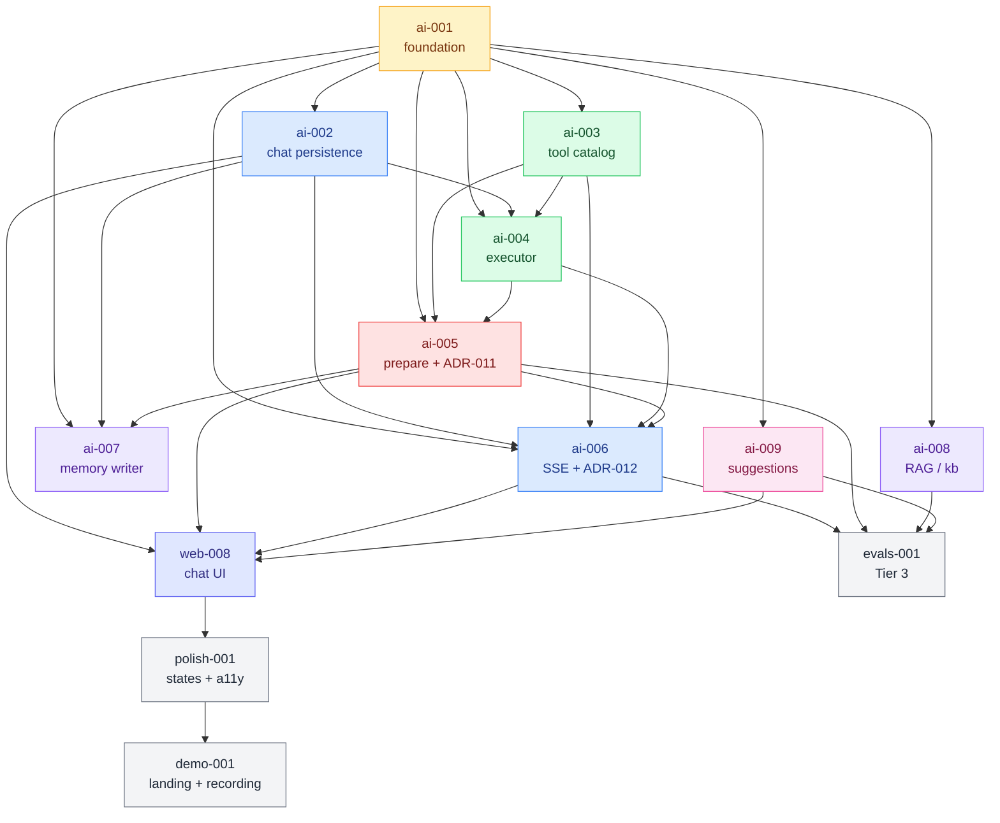

# Phase 4 Briefs — Summary

**VaultChain v1, Phase 4:** AI assistant — Anthropic Claude integration, tool catalog with prepare-not-execute boundary, mid-stream prep cards, transaction memory + RAG infrastructure (Google Gemini embeddings), proactive suggestions, polish pass, and the public landing + demo recording that closes V1.

---

## Exit criteria (verbatim, Phase 4 success definition)

A user opens the chat panel from the dashboard, types "send 0.05 ETH to 0xabc…" → assistant streams response, calls `get_balances` then `prepare_send_transaction` (visible inline as tool-running pills) → prep card appears with chain icon, amount, fee preview, and policy decision → user clicks Confirm → TOTP modal → assistant's prep card morphs to Submitted state → transaction broadcasts → confirmed → memory writer asynchronously embeds the transaction summary → next session, user asks "did I send anything to 0xabc recently?" → V1 substrate is in place (V2 chat-context RAG retrieves and answers).

Concurrent surfaces: dashboard suggestions strip shows proactive banners (low balance, KYC incomplete, large pending withdrawal); landing page at root URL communicates the project to recruiters/engineers in 90 seconds; Tier-3 evals pipeline produces a baseline quality report committed to the repo.

---

## Brief inventory (13 total)

| # | Brief ID | Title | C | SDD mode | Lines |
|---|----------|-------|---|----------|------:|
| 1  | `phase4-ai-001`      | AI infrastructure (Anthropic + Gemini adapters + pgvector + ADR-010)  | L | strict      | 173 |
| 2  | `phase4-ai-002`      | Chat aggregate + `ai.conversations`/`ai.messages` persistence         | M | strict      | 165 |
| 3  | `phase4-ai-003`      | Read-only tool catalog (3 tools)                                      | M | strict      | 162 |
| 4  | `phase4-ai-004`      | Tool executor + `ai.tool_calls` audit + truncation                    | M | strict      | 161 |
| 5  | `phase4-ai-005`      | `prepare_send_transaction` + PreparedAction aggregate + ADR-011       | L | strict      | 187 |
| 6  | `phase4-ai-006`      | Chat SSE endpoint + custom event protocol + ADR-012                   | L | strict      | 181 |
| 7  | `phase4-ai-007`      | Memory writer + `ai.tx_memory_embeddings` + cross-user-leak property  | L | strict      | 182 |
| 8  | `phase4-ai-008`      | RAG over product docs (`ai.kb_embeddings` + ingestion CLI)            | M | strict      | 189 |
| 9  | `phase4-ai-009`      | Suggestions sub-domain (3 rules + worker + REST)                      | M | strict      | 206 |
| 10 | `phase4-web-008`     | Chat panel UI + prep card + suggestions strip + Playwright E2E        | L | lightweight | 193 |
| 11 | `phase4-polish-001`  | Empty/loading/error states pass + mobile responsive QA                | M | lightweight | 170 |
| 12 | `phase4-evals-001`   | Tier-3 live evals harness (manual, not CI gate)                       | S | strict      | 165 |
| 13 | `phase4-demo-001`    | Landing copy + demo recording + README overhaul                       | S | lightweight | 151 |

**Counts.** Complexity: S × 2, M × 5, L × 6, XL × 0. SDD mode: strict × 9, lightweight × 4. Total ~190 KB across 13 briefs, 157 ACs.

---

## Dependency graph

**Critical path (longest):** ai-001 → ai-002 → ai-004 → ai-005 → ai-006 → web-008 → polish-001 → demo-001 (8 briefs sequentially). Parallel branches: ai-003 (parallel to ai-002), ai-007 (parallel to ai-006), ai-008 (parallel from ai-001), ai-009 (parallel from ai-001), evals-001 (parallel after ai-006).

---

## Exit/integration order

1. `phase4-ai-001` (foundation) — unblocks all of Phase 4.
2. `phase4-ai-002` (chat persistence) — unblocks SSE endpoint + memory subscriber.
3. `phase4-ai-003` (read-only tool catalog) — three tools registered.
4. `phase4-ai-004` (tool executor) — dispatches everything in catalog.
5. `phase4-ai-005` (prepare tool + PreparedAction + ADR-011) — defence-in-depth for the most architecturally-sensitive boundary.
6. `phase4-ai-006` (SSE endpoint + ADR-012) — integration brief; ai-001..005 carry water.
7. `phase4-ai-007` (memory writer + cross-user-leak property) — tx-memory substrate for V2 chat-context RAG.
8. `phase4-ai-008` (kb embeddings + RAG CLI) — kb retrieval substrate, parallel to tx memory.
9. `phase4-ai-009` (suggestions) — independent surface; ships once REST endpoints are reachable.
10. `phase4-web-008` (chat panel UI) — frontend consumer of all of the above.
11. `phase4-polish-001` (states pass + a11y) — across all surfaces of all phases.
12. `phase4-evals-001` (Tier 3 evals) — quality baseline + portfolio artefact.
13. `phase4-demo-001` (landing + demo + README) — closes V1.

---

## ADRs touched

* **ADR-010 — Embedding model and dimension choice** (drafted in `phase4-ai-001`). Binds Google `gemini-embedding-001` at **768 dims** via Matryoshka truncation; `task_type='RETRIEVAL_DOCUMENT'` on writes, `'RETRIEVAL_QUERY'` on reads. Supersedes the illustrative `VECTOR(1536)` in architecture-decisions §"Vector store". Defers ivfflat parameters and per-user-scoping enforcement to `phase4-ai-007`.
* **ADR-011 — Prepare-not-execute boundary** (drafted in `phase4-ai-005`). Realises invariant #1 from architecture-decisions ("Never execute, only prepare") as a `PreparedAction` aggregate with a four-state machine (`pending → {confirmed, expired, superseded}`). Defence-in-depth alongside the import-linter "AI never imports Custody" contract.
* **ADR-012 — SSE event protocol contract** (drafted in `phase4-ai-006`). Codifies eight wire events (seven from architecture + `prepared_action_superseded`), ordering invariants, system-prompt-hash drift detection for Tier-2 fixtures, deliberate non-features (no mid-stream resume, no WebSocket).

No existing ADRs (006/007 from canon, 008/009 from Phase 3) re-touched.

---

## Schema changes (delta vs Phase 3)

* **New schema:** `ai` (created in `phase4-ai-001`).
* **New tables (all in `ai`):**
  * `ai.conversations`, `ai.messages` (`phase4-ai-002`).
  * `ai.tool_calls` (`phase4-ai-004`).
  * `ai.prepared_actions` (`phase4-ai-005`).
  * `ai.tx_memory_embeddings` (`phase4-ai-007`).
  * `ai.kb_embeddings` (`phase4-ai-008`).
  * `ai.suggestions` (`phase4-ai-009`).
* **New extensions:** `pgvector` (installed in `phase4-ai-001`).
* **New cross-schema FKs:** `ai.conversations.user_id → identity.users.id`; `ai.tool_calls.conversation_id/message_id → ai.conversations/messages`; `ai.prepared_actions.user_id → identity.users.id`, `.conversation_id → ai.conversations.id`, `.tool_call_id → ai.tool_calls.id`, `.confirmed_transaction_id → transactions.transactions.id`; `ai.tx_memory_embeddings.user_id/tx_id → identity.users.id / transactions.transactions.id`; `ai.suggestions.user_id → identity.users.id`.
* **No tables modified** in other schemas. (Phase 3 already added `transactions.transactions.value_usd_at_creation` and `came_via_admin`; Phase 4 reads them.)

---

## New ports (delta vs Phase 3)

| Port | Brief | Purpose |
|---|---|---|
| `LlmClient` | ai-001 | Anthropic abstraction; `stream_message`, `complete` |
| `EmbeddingsClient` | ai-001 | Gemini abstraction; `embed_one`, `embed_batch` with `task_type` |
| `ConversationRepository`, `MessageRepository` | ai-002 | Chat persistence |
| `Tool` Protocol | ai-003 | Tool self-description + execute |
| `ToolCallRepository` | ai-004 | Audit log |
| `PreparedActionRepository` | ai-005 | PA persistence + state-machine support |
| `ConnectionLimiter` | ai-006 | Per-user concurrent SSE cap |
| `TxMemoryEmbeddingRepository`, `TxMemoryRetriever` | ai-007 | User-scoped vector search |
| `KbEmbeddingRepository`, `KbRetriever`, `MarkdownChunker` | ai-008 | Global product-doc retrieval |
| `SuggestionRepository`, `SuggestionRule` | ai-009 | Pluggable rule registry |

Plus fakes for every port in `tests/ai/fakes/`.

---

## Property tests added in Phase 4

These are the architecture-mandated property tests that ship alongside their briefs (per `architecture-decisions.md` §"Mandatory property tests"). All are new in Phase 4.

| # | Property | Brief | Bound AC |
|---|----------|-------|----------|
| 14 | Per-user authorization invariant on chat ops | `ai-002` | AC-phase4-ai-002-12 |
| 15 | Tool executor truncation correctness across sizes | `ai-004` | AC-phase4-ai-004-12 |
| 16 | PreparedAction state-machine no-orphan-states + sink-finality | `ai-005` | AC-phase4-ai-005-13 |
| 17 | SSE event ordering invariants (6 sub-properties) | `ai-006` | AC-phase4-ai-006-13 |
| 18 | **Cross-user-leak prevention in tx_memory search** (most security-critical) | `ai-007` | AC-phase4-ai-007-12 |
| 19 | Suggestion state-machine no-orphan-states | `ai-009` | AC-phase4-ai-009-12 |

Plus secondary property tests within briefs (e.g., `ai-002` AC-04 message-content-block round-trip, `ai-005` AC-03 SendPayload round-trip) — total ≥9 property test files across Phase 4.

---

## Cron jobs added in Phase 4

| Job | Brief | Cadence | Purpose |
|---|---|--:|---|
| `expire_prepared_actions` | ai-005 | 60s | Mark `pending` PAs past `expires_at` as `expired` |
| `evaluate_suggestions_periodic` | ai-009 | 5 min | Per-user rule evaluation, batched |
| `expire_suggestions_sweeper` | ai-009 | 60s | Mark `pending` suggestions past `expires_at` as `expired` |

All disable-flagged via env vars for local dev (`EXPIRE_PREPARED_ACTIONS_ENABLED`, `EVALUATE_SUGGESTIONS_ENABLED`).

---

## Import-linter contracts added in Phase 4

* **"AI never imports Custody"** (ai-001) — the canonical invariant; forbids `vaultchain.ai → vaultchain.custody`.
* **"AI sub-domains do not import ai.infra"** (ai-001) — port-mediated access discipline.
* **"ai.infra does not import any sub-domain"** (ai-001) — one-way dependency.
* **"ai.memory raw SQL banned in application"** (ai-007) — defence-in-depth for cross-user-leak prevention; only `ai.memory.infra` may import `sqlalchemy`.

---

## Operator surface (admin / CLI)

* **Admin** — no new admin-facing endpoints in Phase 4 (admin doesn't have an AI assistant in V1; explicit non-goal in `phase4-ai-006`).
* **CLI** (`vaultchain ...`):
  * `vaultchain kb ingest <docs_path>` (ai-008)
  * `vaultchain kb list` (ai-008)
  * `vaultchain kb search <query>` (ai-008)
  * `vaultchain evals run [--scenarios=...]` (evals-001)
  * `vaultchain evals report <report.json>` (evals-001)
* **Runbook updates** (consolidated):
  * pgvector install / Neon prerequisite (ai-001)
  * Re-recording Anthropic cassettes / Tier-2 fixtures (ai-001, ai-006)
  * Disabling expiry sweeper / suggestions evaluator in emergencies (ai-005, ai-009)
  * Inspecting cross-user-leak property test failures (ai-007)
  * Tuning ivfflat probes for vector search (ai-007, ai-008)
  * Tier-3 evals run procedure (evals-001)

---

## Configuration additions (env vars)

| Var | Default | Brief | Purpose |
|---|---|---|---|
| `ANTHROPIC_API_KEY` | (required) | ai-001 | Anthropic |
| `GOOGLE_API_KEY` | (required) | ai-001 | Gemini embeddings |
| `AI_MODEL_CHAT` | `claude-sonnet-4-6` | ai-001 | LLM model override (the older `claude-sonnet-4-20250514` is deprecated per Anthropic; configurable via env) |
| `AI_MODEL_EMBEDDING` | `gemini-embedding-001` | ai-001 | Embedding model |
| `AI_MAX_TOKENS` | `4096` | ai-001 | Per-turn cap |
| `AI_TIMEOUT_SECONDS` | `60` | ai-001 | Anthropic stream timeout |
| `EMBEDDING_DIM` | `768` | ai-001 | Vector dimension (cannot change without re-embed) |
| `PREPARED_ACTION_TTL_SECONDS` | `300` | ai-005 | 5-min prep card expiry |
| `EXPIRE_PREPARED_ACTIONS_ENABLED` | `true` | ai-005 | Sweeper toggle |
| `MEMORY_WRITE_NON_AI_TRANSACTIONS` | `false` | ai-007 | Memorize wizard-confirmed tx (V2-staged) |
| `KB_DEFAULT_MIN_SIMILARITY` | `0.65` | ai-008 | RAG retrieval floor |
| `KB_DEFAULT_LIMIT` | `5` | ai-008 | RAG result count |
| `EVALUATE_SUGGESTIONS_ENABLED` | `true` | ai-009 | Evaluator toggle |
| `EVALUATE_SUGGESTIONS_INTERVAL_SECONDS` | `300` | ai-009 | 5-min cadence |
| `LOW_BALANCE_USD_THRESHOLD` | `10` | ai-009 | LowBalanceRule trigger |
| `LARGE_PENDING_WITHDRAWAL_USD_THRESHOLD` | `1000` | ai-009 | LargePendingWithdrawalRule trigger |
| `SUGGESTION_TTL_DAYS` | `7` | ai-009 | Default expiry |

---

## OpenAPI surface change (delta vs Phase 3)

New endpoints:

* `GET /api/v1/ai/conversations` — list user's conversations (ai-002)
* `GET /api/v1/ai/conversations/{id}` — read one + paginated messages (ai-002)
* `POST /api/v1/ai/conversations/{id}/archive` — archive (ai-002)
* `POST /api/v1/ai/chat` — chat turn (ai-006); content-negotiated SSE / JSON
* `POST /api/v1/ai/prepared-actions/{id}/confirm` — TOTP-gated confirmation (ai-005)
* `GET /api/v1/ai/suggestions` — list pending banners (ai-009)
* `POST /api/v1/ai/suggestions/{id}/dismiss` — dismiss banner (ai-009)

JSON Schema for the eight SSE wire events committed at `docs/api/ai-sse-events.schema.json` (ai-006).

No existing endpoints modified.

---

## What's outside V1 / explicit V2 backlog

Cross-cutting V2 backlog accumulated from individual briefs' Out-of-Scope sections:

* **Chat-context RAG injection** (memory + kb consumed in system prompt) — substrate ready (ai-007 + ai-008), wiring is V2.
* **Memory-aware tools** the LLM can invoke (`search_my_transaction_history`) — V2.
* **Re-embedding migration** when embedding model changes — backlog item per ADR-010.
* **GDPR delete cascade** for AI artifacts — V2 (a separate brief in V2 plumbing).
* **Column-level encryption of AI content** (chat messages, prepared_action payloads, summaries) — V2 PII pin per architecture-decisions.
* **Mid-stream SSE resume** — explicit non-feature per ADR-012; polling fallback covers.
* **WebSocket transport** — explicit non-feature per architecture-decisions.
* **Auto-titled conversations** (small LLM job) — V2.
* **Stop / cancel button for streaming chat** — V2.
* **LLM-driven suggestions** (versus the 3 deterministic rules in V1) — V2; rule registry pattern accommodates.
* **Push notifications for suggestions** — V2 via `phase2-notifications-001`.
* **Admin UIs for AI** (chat history viewer, kb management, suggestion management) — V2.
* **Multilingual UI strings** — V2; the LLM itself handles UI-language requests in chat.
* **Memorising deposits and failed/expired transactions** — V2.
* **Per-user opt-out of memory recording** — V2 privacy feature.
* **Adversarial / red-team eval scenarios** — V2 evals expansion.

---

## Phase 4 in numbers

* **13 briefs** (9 strict, 4 lightweight)
* **157 ACs** total
* **3 new ADRs** (ADR-010, ADR-011, ADR-012)
* **6 new mandatory property tests** (#14–#19)
* **1 new schema** (`ai`) with 7 tables
* **15 new domain ports** (across all sub-domains)
* **8+ new domain events** (registered in `shared/events/registry.py`)
* **3 new cron jobs**
* **4 new import-linter contracts**
* **7 new HTTP endpoints**
* **5 new CLI commands** (across `kb` and `evals` subcommands)
* **18 new env vars**

Phase 4 closes V1.
